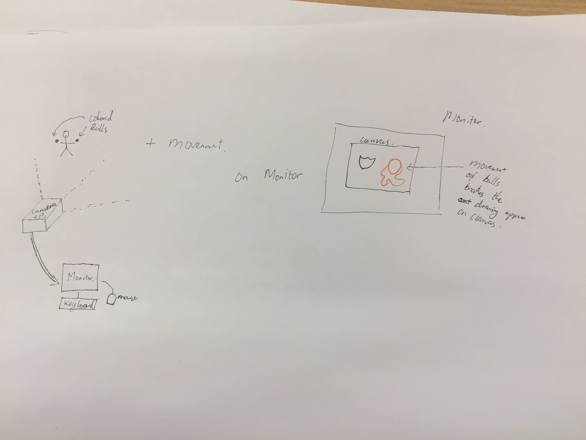
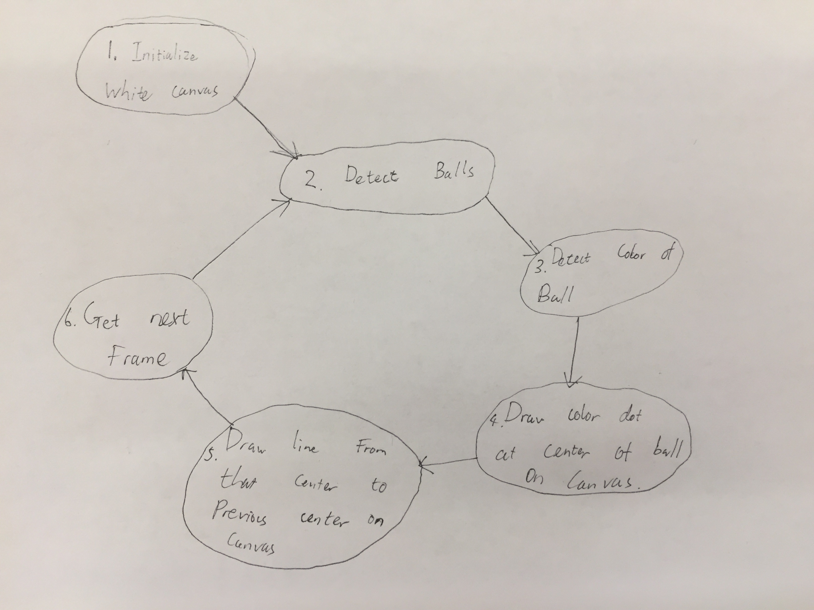

# IDD-Fa18-Final_Project
Interactive Art by Karim Arem and Brian Pfaff.

We are introducing a new way to think about and create art by incorporating human movement and arm actions into the creation of it using computer vision on a mobile pi. We believe that by using different colored balls in the users hands, we could turn the creation of art into a more physically active, interactive as well as easier activity where users can use full body movement to draw on a digital white canvas and save it instantly rather than the more expensive task of sitting down and drawing on a physical canvas.  

# Paper Prototype:

 

# State Diagrams:

 


# Needed parts:

1. Raspberry pi 3
2. Raspberry pi camera 2
and either a: 
3. Monitor, Mouse and Keyboard or  
4. Laptop

# Setup: 

1. First connect the camera to the pi as seen in this [example](https://www.youtube.com/watch?v=PyGM4Iah0cM).
2. After this power up the Raspberry Pi plug in your mouse, keyboard and monitor or ssh into the pi with your laptop. 
3. Save this [file]() below to the pi in a file called Ball_Art_files
4. Once in the pi, run these commands in the terminal to start the program.

``` 
cd Ball_Art_files
workon cv
python ballArt.py
```
5. Draw to your hearts content and click q to save your image.
6. Rerun ``` python Ball_Art.py ``` to start again.

Note: If you want a casing for the pi use this [SVG file](https://github.com/bripfaff/IDD-Fa18-Final_Project/blob/master/boxp1%20(1)%20(1).svg) as it is setup to work with the Raspberry pi 3, the camera and allow space for the HDMI, Mouse and keyboard USB plug-ins. 

# [Project Code]()


# [Final Video]()
